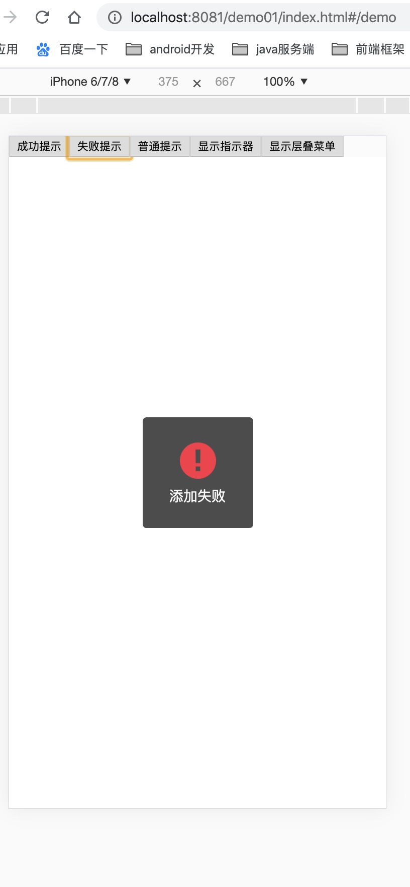
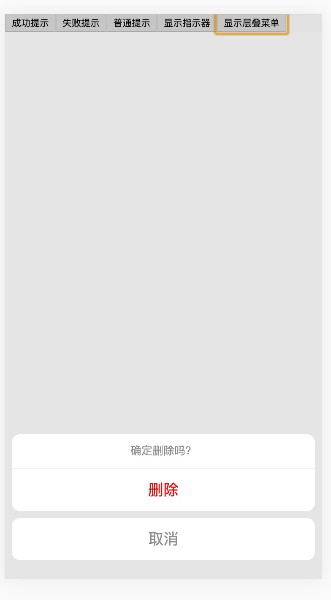
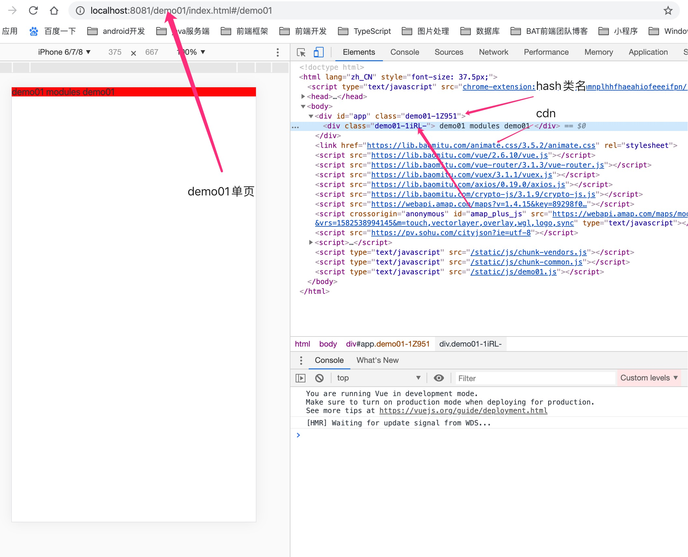
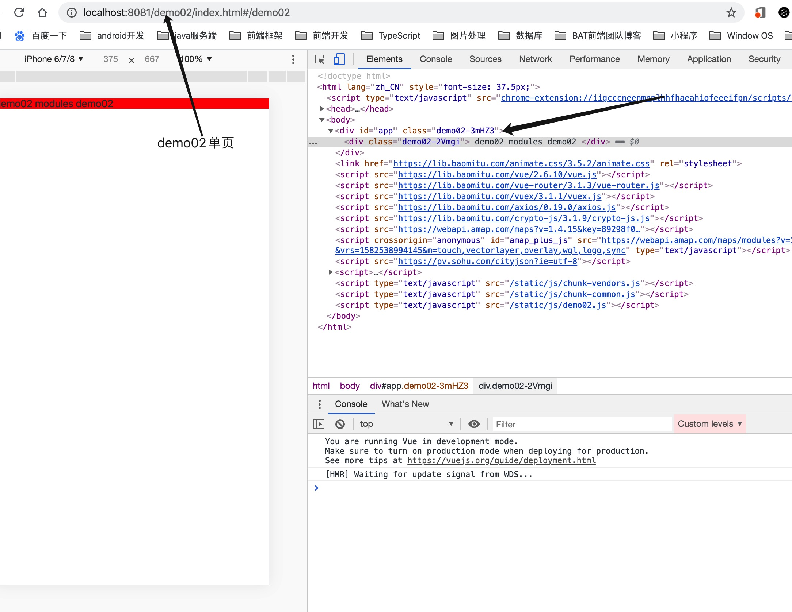
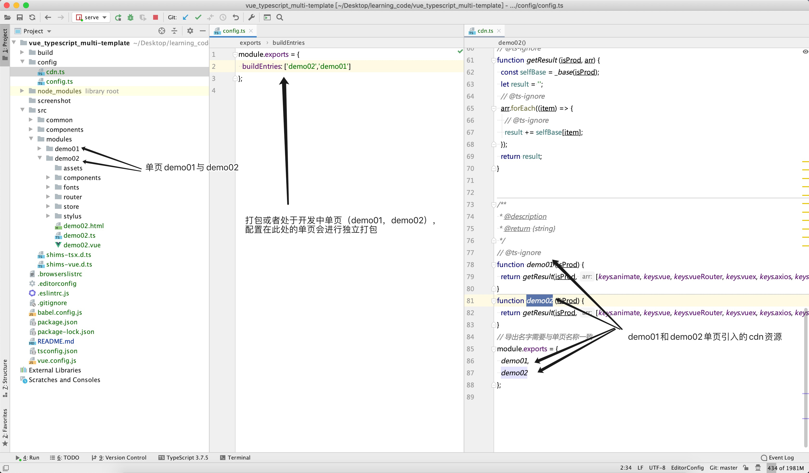

# Vue TypeScript多页项目模板

## 安装依赖
```
npm install 或者 cnpm install
```

### 开发模式
```
npm run serve
```

### 生产打包
```
npm run build
```

### Run your tests
```
npm run test
```

###  项目特点
```
1、单个项目实现多个单页开发（项目a、项目b），可独立打包各个单页且打包后内容按照单页分割，互不影响，也不会因为更改某一个
单页导致其他单页也需要打包一起发布，从而减少对线上其他版本影响，便于维护

2、大部分开发依赖采用cdn方式引入，减少打包时长和加快网页加载速度

3、路由配置为懒加载，js独立打包，gz压缩

4、添加编辑器代码风格约束，便于多人共同协作

5、增加eslint代码格式约束

6、css样式采用module方式，实现生成的class类名为hash值，增强了css代码安全性

7、git commit增加了tslint检查，如果检查通不过，则不允许提交到git

```

### 项目效果及使用方法

</b>
</b>
</b>
</b>
</b>
</b>
</b>
</b>
</b>
